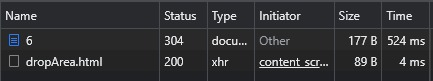
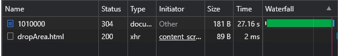
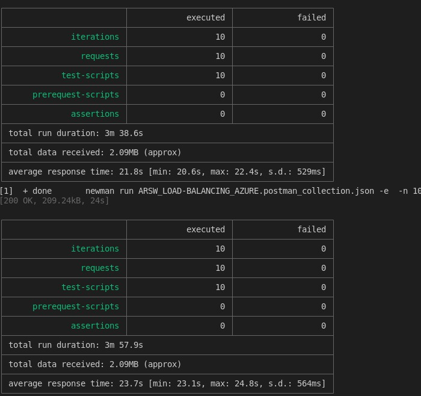
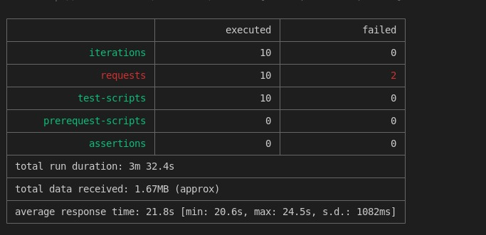

### Escuela Colombiana de Ingeniería
### Arquitecturas de Software - ARSW

## Escalamiento en Azure con Maquinas Virtuales, Sacale Sets y Service Plans

### Dependencias
* Cree una cuenta gratuita dentro de Azure. Para hacerlo puede guiarse de esta [documentación](https://azure.microsoft.com/es-es/free/students/). Al hacerlo usted contará con $100 USD para gastar durante 12 meses.

### Parte 0 - Entendiendo el escenario de calidad

Adjunto a este laboratorio usted podrá encontrar una aplicación totalmente desarrollada que tiene como objetivo calcular el enésimo valor de la secuencia de Fibonnaci.

**Escalabilidad**
Cuando un conjunto de usuarios consulta un enésimo número (superior a 1000000) de la secuencia de Fibonacci de forma concurrente y el sistema se encuentra bajo condiciones normales de operación, todas las peticiones deben ser respondidas y el consumo de CPU del sistema no puede superar el 70%.

### Parte 1 - Escalabilidad vertical

1. Diríjase a el [Portal de Azure](https://portal.azure.com/) y a continuación cree una maquina virtual con las características básicas descritas en la imágen 1 y que corresponden a las siguientes:
    * Resource Group = SCALABILITY_LAB
    * Virtual machine name = VERTICAL-SCALABILITY
    * Image = Ubuntu Server 
    * Size = Standard B1ls
    * Username = scalability_lab
    * SSH publi key = Su llave ssh publica


2. Para conectarse a la VM use el siguiente comando, donde las `x` las debe remplazar por la IP de su propia VM (Revise la sección "Connect" de la virtual machine creada para tener una guía más detallada).

    `ssh scalability_lab@xxx.xxx.xxx.xxx`

3. Instale node, para ello siga la sección *Installing Node.js and npm using NVM* que encontrará en este [enlace](https://linuxize.com/post/how-to-install-node-js-on-ubuntu-18.04/).
4. Para instalar la aplicación adjunta al Laboratorio, suba la carpeta `FibonacciApp` a un repositorio al cual tenga acceso y ejecute estos comandos dentro de la VM:

    `git clone <your_repo>`

    `cd <your_repo>/FibonacciApp`

    `npm install`

5. Para ejecutar la aplicación puede usar el comando `npm FibinacciApp.js`, sin embargo una vez pierda la conexión ssh la aplicación dejará de funcionar. Para evitar ese compartamiento usaremos *forever*. Ejecute los siguientes comando dentro de la VM.

    ` node FibonacciApp.js`

6. Antes de verificar si el endpoint funciona, en Azure vaya a la sección de *Networking* y cree una *Inbound port rule* tal como se muestra en la imágen. Para verificar que la aplicación funciona, use un browser y user el endpoint `http://xxx.xxx.xxx.xxx:3000/fibonacci/6`. La respuesta debe ser `The answer is 8`.




7. La función que calcula en enésimo número de la secuencia de Fibonacci está muy mal construido y consume bastante CPU para obtener la respuesta. Usando la consola del Browser documente los tiempos de respuesta para dicho endpoint usando los siguintes valores:
    * 1000000
    
        
    * 1010000

        
    * 1020000

        
    * 1030000

        
    * 1040000

        
    * 1050000

        
    * 1060000

        
    * 1070000

        
    * 1080000

        
    * 1090000

        

8. Dírijase ahora a Azure y verifique el consumo de CPU para la VM. (Los resultados pueden tardar 5 minutos en aparecer).

    

9. Ahora usaremos Postman para simular una carga concurrente a nuestro sistema. Siga estos pasos.
    * Instale newman con el comando `npm install newman -g`. Para conocer más de Newman consulte el siguiente [enlace](https://learning.getpostman.com/docs/postman/collection-runs/command-line-integration-with-newman/).
    * Diríjase hasta la ruta `FibonacciApp/postman` en una maquina diferente a la VM.
    * Para el archivo `[ARSW_LOAD-BALANCING_AZURE].postman_environment.json` cambie el valor del parámetro `VM1` para que coincida con la IP de su VM.
    * Ejecute el siguiente comando.

    ```
    newman run ARSW_LOAD-BALANCING_AZURE.postman_collection.json -e [ARSW_LOAD-BALANCING_AZURE].postman_environment.json -n 10 &
    newman run ARSW_LOAD-BALANCING_AZURE.postman_collection.json -e [ARSW_LOAD-BALANCING_AZURE].postman_environment.json -n 10
    ```

    
    
    
10. La cantidad de CPU consumida es bastante grande y un conjunto considerable de peticiones concurrentes pueden hacer fallar nuestro servicio. Para solucionarlo usaremos una estrategia de Escalamiento Vertical. En Azure diríjase a la sección *size* y a continuación seleccione el tamaño `B2ms`.


11. Una vez el cambio se vea reflejado, repita el paso 7, 8 y 9.
    * 1000000
    
        
    * 1010000

        
    * 1020000

        
    * 1030000

        
    * 1040000

        
    * 1050000

        
    * 1060000

        
    * 1070000

        
    * 1080000

        
    * 1090000

        
    * Consumo CPU
        
        
    * Carga concurrente

        
        
        
12. Evalue el escenario de calidad asociado al requerimiento no funcional de escalabilidad y concluya si usando este modelo de escalabilidad logramos cumplirlo.

    Como se puede ver en las imagenes, no se cumple el requerimiento funcional porque con el *escalamiento horizontal* se siguen presentando errores al momento de realizar la carga concurrente y aunque el tiempo haya disminuido sigue siendo un total de duración bastante alto.
13. Vuelva a dejar la VM en el tamaño inicial para evitar cobros adicionales.

**Preguntas**

1. ¿Cuántos y cuáles recursos crea Azure junto con la VM?
Crea 7 y son:
    * Red virtual (vnet)
    * Interfaz de red
    * Maquina virtual
    * Dirección IP pública
    * Grupo de seguridad de red
    * Clave SSH
    * Disco

    Así como se ve en la siguiente imagen:
    

2. ¿Brevemente describa para qué sirve cada recurso?
* Red virtual (vnet): Conección de internet virtualizada de la VM
* Interfaz de red: Es la tarjeta de red de la VM
* Maquina virtual: El sistema operativo completo; siendo este caso Ubuntu, incluye procesador, memoria, entre otros
* Dirección IP pública: Para conectarse a internet debe tener una IP pública
* Grupo de seguridad de red: Grupo que permite habilitar puertos tanto de entrada como de salida
* Clave SSH: Se usa para hacer la conección entre la VM y el usuario
* Disco: Almacenamiento
3. ¿Al cerrar la conexión ssh con la VM, por qué se cae la aplicación que ejecutamos con el comando `npm FibonacciApp.js`? ¿Por qué debemos crear un *Inbound port rule* antes de acceder al servicio?

    Porque el proceso de node esta vinculado con la consola abierta por lo que si se cierra o se pierde conección se termina el proceso. Para ejecutarlo en segundo plano se debe agregar -g para que este desvinculado de la consola.
    Hay que modificar los grupos de seguridad que vienen por defecto para poder habilitar el puerto por el que se quiere hacer la conección y que esta sea visible en internet.

4. Adjunte tabla de tiempos e interprete por qué la función tarda tando tiempo.
    
    
    
    Se tarda tanto porque para calcular un valor debe calcular todos los valores anteriores ya que no memoriza ninguno.
5. Adjunte imágen del consumo de CPU de la VM e interprete por qué la función consume esa cantidad de CPU.
    * Antes
    
    * Después
    

    Porque al tener que realizar todos los calculos de los valores anteriores, cada uno de estos consume CPU, además hace el recorrido de forma iterativa.
6. Adjunte la imagen del resumen de la ejecución de Postman. Interprete:

    
    
    * Tiempos de ejecución de cada petición.

        Se pueden apreciar en los tiempos de ejecución que si la maquina esta procesando más de una petición, estas dos tendran un tiempo más elevado.
        
    * Si hubo fallos documentelos y explique.
    
        Se presentaron fallos en la 2 y la 8 y suponemos que se produjeron porque las peticiones llegaron al tiempo por lo que estas fueron rechazadas. Aparte de esto creemos que el CPU llego a su limite.
7. ¿Cuál es la diferencia entre los tamaños `B2ms` y `B1ls` (no solo busque especificaciones de infraestructura)?

    El rendimiento del B2ms es superior al B1sl ya que cuenta con mejor performance de CPU, mayor memoria, más cores y más ventajas las cuales se ven reflejadas en un precio más elevado.
8. ¿Aumentar el tamaño de la VM es una buena solución en este escenario?, ¿Qué pasa con la 
    FibonacciApp cuando cambiamos el tamaño de la VM?

    Como se puede apreciar en las pruebas de cargas, el tiempo minimo se redujho un seghudo pero el maximo se redujo casi la mitad del tiempo mostrando una mejora significativa en los tiempos de espera. Pese a disminuir el tiempo máximo, no consideramos que sea una solución viable, ya que como mencionamos anteriormente este tamañano significa un precio más elevado sin una fuerte justificación.
9. ¿Qué pasa con la infraestructura cuando cambia el tamaño de la VM? ¿Qué efectos negativos implica?
* Los creditos con los que se arracan se duplican
* El performance base del CPU es 8 veces más alto, generando mayor consumo no justificado
10. ¿Hubo mejora en el consumo de CPU o en los tiempos de respuesta? Si/No ¿Por qué?

    No hubo mejoras porque hubo un pico del 100% debido a que el programa no esta diseñado para usar multiples procesadores.

11. Aumente la cantidad de ejecuciones paralelas del comando de postman a `4`. ¿El comportamiento del sistema es porcentualmente mejor?
    
    No porque como podemos ver en las imágenes mostradas anteriormente el tiempo de respuesta y el número de fallas aumentaron casi el doble.

### Parte 2 - Escalabilidad horizontal

#### Crear el Balanceador de Carga

Antes de continuar puede eliminar el grupo de recursos anterior para evitar gastos adicionales y realizar la actividad en un grupo de recursos totalmente limpio.

1. El Balanceador de Carga es un recurso fundamental para habilitar la escalabilidad horizontal de nuestro sistema, por eso en este paso cree un balanceador de carga dentro de Azure tal cual como se muestra en la imágen adjunta.


2. A continuación cree un *Backend Pool*, guiese con la siguiente imágen.


3. A continuación cree un *Health Probe*, guiese con la siguiente imágen.


4. A continuación cree un *Load Balancing Rule*, guiese con la siguiente imágen.


5. Cree una *Virtual Network* dentro del grupo de recursos, guiese con la siguiente imágen.


#### Crear las maquinas virtuales (Nodos)

Ahora vamos a crear 3 VMs (VM1, VM2 y VM3) con direcciones IP públicas standar en 3 diferentes zonas de disponibilidad. Después las agregaremos al balanceador de carga.

1. En la configuración básica de la VM guíese por la siguiente imágen. Es importante que se fije en la "Avaiability Zone", donde la VM1 será 1, la VM2 será 2 y la VM3 será 3.


2. En la configuración de networking, verifique que se ha seleccionado la *Virtual Network*  y la *Subnet* creadas anteriormente. Adicionalmente asigne una IP pública y no olvide habilitar la redundancia de zona.


3. Para el Network Security Group seleccione "avanzado" y realice la siguiente configuración. No olvide crear un *Inbound Rule*, en el cual habilite el tráfico por el puerto 3000. Cuando cree la VM2 y la VM3, no necesita volver a crear el *Network Security Group*, sino que puede seleccionar el anteriormente creado.


4. Ahora asignaremos esta VM a nuestro balanceador de carga, para ello siga la configuración de la siguiente imágen.


5. Finalmente debemos instalar la aplicación de Fibonacci en la VM. para ello puede ejecutar el conjunto de los siguientes comandos, cambiando el nombre de la VM por el correcto

```
git clone https://github.com/daprieto1/ARSW_LOAD-BALANCING_AZURE.git

curl -o- https://raw.githubusercontent.com/creationix/nvm/v0.34.0/install.sh | bash
source /home/vm1/.bashrc
nvm install node

cd ARSW_LOAD-BALANCING_AZURE/FibonacciApp
npm install

npm install forever -g
forever start FibonacciApp.js
```

Realice este proceso para las 3 VMs, por ahora lo haremos a mano una por una, sin embargo es importante que usted sepa que existen herramientas para aumatizar este proceso, entre ellas encontramos Azure Resource Manager, OsDisk Images, Terraform con Vagrant y Paker, Puppet, Ansible entre otras.

#### Probar el resultado final de nuestra infraestructura

1. Porsupuesto el endpoint de acceso a nuestro sistema será la IP pública del balanceador de carga, primero verifiquemos que los servicios básicos están funcionando, consuma los siguientes recursos:

```
http://52.155.223.248/
http://52.155.223.248/fibonacci/1
```


2. Realice las pruebas de carga con `newman` que se realizaron en la parte 1 y haga un informe comparativo donde contraste: tiempos de respuesta, cantidad de peticiones respondidas con éxito, costos de las 2 infraestrucruras, es decir, la que desarrollamos con balanceo de carga horizontal y la que se hizo con una maquina virtual escalada.
    
    *Las imagenes de este punto se pueden encontrar en la penúltima respuesta de este informe.*
3. Agregue una 4 maquina virtual y realice las pruebas de newman, pero esta vez no lance 2 peticiones en paralelo, sino que incrementelo a 4. Haga un informe donde presente el comportamiento de la CPU de las 4 VM y explique porque la tasa de éxito de las peticiones aumento con este estilo de escalabilidad.

```
newman run ARSW_LOAD-BALANCING_AZURE.postman_collection.json -e [ARSW_LOAD-BALANCING_AZURE].postman_environment.json -n 10 &
newman run ARSW_LOAD-BALANCING_AZURE.postman_collection.json -e [ARSW_LOAD-BALANCING_AZURE].postman_environment.json -n 10 &
newman run ARSW_LOAD-BALANCING_AZURE.postman_collection.json -e [ARSW_LOAD-BALANCING_AZURE].postman_environment.json -n 10 &
newman run ARSW_LOAD-BALANCING_AZURE.postman_collection.json -e [ARSW_LOAD-BALANCING_AZURE].postman_environment.json -n 10
```




 Con este estilo de escalabilidad se tuvo la opción de distribuir el procesamiento en las 4 máquinas virtuales y como se evidencian en las imágenes se logró el mejor tiempo junto a la ejecución total de las pruebas mandadas, gracias a que con este estilo todas las peticiones fueron atendidas y de forma más rápida, algo que no se podia lograr con la escalabilidad vertical de la parte 1.

**Preguntas**

* 1) ¿Cuáles son los tipos de balanceadores de carga en Azure y en qué se diferencian?

        Los balanceadores que ofrece Azure son:
        * Público: Cuenta con una IP pública en el frontend que recibira las peticiones y las repetirá entre las máquinas del backend.
        * Interno: Cuenta con una IP privada por lo que no sera accesible desde internet pero atiende las peticiones igual que el público.
* 2) ¿Qué es SKU, qué tipos hay y en qué se diferencian?

        SKU significa Stock Keeping Unit y es una unidad de mantenimineto de existencias adquirible bajo un producto, representando las diferentes formas de este.
        Sus tipos en Azure:
        * Standar_LRS: Almacenamiento con redundancia local estándar, admitido en cuentas como Storage, BlobStorage, StorageV2
        * Standar_GRS: Almacenamiento replicado geográfico estándar, admitido en cuentas como Storage, BlobStorage, StorageV2
        * Standar_RAGRS: Almacenamiento replicado geográfico con acceso de lectura estándar, admitido en cuentas como Storage, BlobStorage, StorageV2
        * Standar_ZRS: Almacenamiento redundante de zona estándar, admitido en cuentas como Storage, StorageV2
        * Premium_LRS: Almacenamiento redundante local de E/S aprovisionadas, admitido en cuentas como Storage, BlockBlobStorage, StorageV2, FileStorage
        * Premium_ZRS: Almacenamiento redundante local de E/S aprovisionadas, admitido en cuentas como Storage, StorageV2
        * Standar_GZRS: Almacenamiento redundante local de E/S aprovisionadas, admitido en cuentas como Storage, StorageV2
        * Standar_RAGZRS: Almacenamiento redundante local de E/S aprovisionadas, admitido en cuentas como Storage, StorageV2

        Tambien cabe resaltar que una gran diferencia entre estos SKU es el precio ya que, dependiendo de la tarea, se debe utilizar capacidades y tamaños especificos que afectaran el monto final de los usuarios.
* 3) ¿Por qué el balanceador de carga necesita una IP pública?
    
        En el caso de este laboratorio se uso un balancerador con IP pública y esto es importante ya que nos **permite acceder desde internet** a nuestro frontend.

* ¿Cuál es el propósito del *Backend Pool*?

    El *Backend Pool* es un componente fundamental para el balanceador de carga debido a que este debe definir el grupo de recursos que van a atender el tráfico para cierta regla de balanceo determinada. Por lo que preasigna un rango de direcciones IP para las máquinas virtuales y conjuntos de escalado, definiendo así el equilibrio de carga entre ellos.
* ¿Cuál es el propósito del *Health Probe*?

    El *Health Probe* se encarga de detectar el estado del endpoint, por lo que determina que instancias del Backend Pool recibirán nuevas conexiones; ajustando el balanceo de carga entre las diferentes instancias.
* 1) ¿Cuál es el propósito de la *Load Balancing Rule*?
        Es la encargada de definir **cómo** se distribuye el tráfico a las máquinas virtuales, definiendo el puerto por donde escuchara el frontend, siendo muy importante para evitar errores en las respuestas a las peticiones.
* 2) ¿Qué tipos de sesión persistente existen, por qué esto es importante y cómo puede afectar la escalabilidad del sistema?.
        Los tipos de persistencia son IP de origen, ID de sesión SSL, regla, DESTIP y SRCIPDESTIP que aceptan 250K conexiones persistentes y CookieInsert, URL pasiva, ID de servidor personalizado que tienen un límite de memoria pero en el caso de CookieInsert, si el tiempo de espera no es 0, permite cualquier número de conexiones hasta que la memoria esté limitada.
        
        Pero esta la persistencia de sesiones; la cual dirige todas las solicitudes que se originan desde un cliente lógico independiente a un servidor web de backend independiente, y en este se encuentran la persistencia de cookie aplicada, de equilibrio de carga, basadas en direccion IP y reserva.

        Esto es importante ya que permite mantener el estado de las conexiones en los servidores por lo que al configurarla anula los métodos de equilibrio de carga una vez que se ha seleccionado el servidor por lo que puede afectar la escalabilidad del sistema ademas si la persistencia configurada se aplica a un servicio que está inactivo, el dispositivo usa los métodos de equilibrio de carga para seleccionar un nuevo servicio y el nuevo servicio se vuelve persistente para las solicitudes posteriores del cliente o si el servicio seleccionado está en estado Fuera de servicio, continúa atendiendo las solicitudes pendientes pero no acepta nuevas solicitudes o conexiones.

* ¿Qué es una *Virtual Network*? ¿Qué es una *Subnet*? ¿Para qué sirven los *address space* y *address range*?

    Un **virtual network** (VNet) es el bloque de creación fundamental de una red privada en Azure que permite muchos tipos de recursos de Azure, como Azure Virtual Machines, para comunicarse de forma segura entre usuarios, con Internet y con las redes locales, siendo similar a una red tradicional que funcionaría en su propio centro de datos, pero aporta las ventajas adicionales de la infraestructura de Azure, como la escala, la disponibilidad y el aislamiento.

    Una **subnet** es un rango de direcciones lógicas, que se utiliza cuando se tienen redes demasiado grandes, por lo que se divididen en redes más pequeñas.

    Los **address space** y **address range** sirven para especificar un espacio de direcciones IP privadas personalizadas utilizando direcciones públicas y privadas con su rango.
* ¿Qué son las *Availability Zone* y por qué seleccionamos 3 diferentes zonas?. ¿Qué significa que una IP sea *zone-redundant*?
    
    Una **Availability Zone** es una oferta de alta disponibilidad encargada de proteger sus aplicaciones y datos de los fallos del centro de datos y son ubicaciones físicas únicas dentro de una región de Azure por esto se escogieron 3 zonas diferentes ya que no tendria sentido asignar todas las máquinas a la misma zona.

    Que una IP sea zone-redundant significa que replicara las peticiones y los datos por medio de las Availability Zone.
* ¿Cuál es el propósito del *Network Security Group*?

    Tiene el propósito de filtrar el tráfico de red hacia y desde los recursos de Azure de una red virtual de Azure ya que contiene reglas de seguridad que permiten o deniegan el tráfico de red entrante o el tráfico de red saliente de varios tipos de recursos de Azure. Por esto para poder realizar las conecciones se debian habilitar los puertos del Network Security Group.
* Informe de newman 1 (Punto 2)
    
    Como se puede observar en las imagenes, el número de fallas fue menor a comparación de la parte 1 gracias a la mayor *"capacidad"* de procesamiento que adquirimos al usar un balanceador de carga. Además el tiempo total que tardó la ejecución dismunuyo considerablemente demostrando que la escalabilidad horizontal fue la mejor alternativa.

    
    
    
    

    Como se mencionó anteriormente, se logró conseguir un número de 0 fallas gracias a la cuarta máquina virtual que permitio que todas las peticiones fueran atendidas.
* Presente el Diagrama de Despliegue de la solución.


